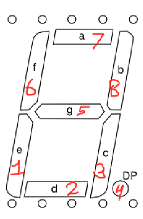

# Seven segments
Seven segments is a library that uses Micropython's machine library (<u>not basic python</u>) to handle 7 (8) segment display (model: 42056W8) 
## Guide
start using by creating object of `SevenSegmentDisplay` type.
`pin_map` is a dictionary, where key means number of segment (see image) and values that means GPIO number pin 

### Methods
- `set(int, bool) -> None` sets the value (On, Off) of specified segment
- `get(int) -> bool` gets the value (On, Off) of specified segment 
- `toggle(int) -> None` sets the opposite value of specified segment
- `light_digit(int, bool) -> None` lights segments in order to display specified digit, boolean value indicated usage of value (On, Off) of dot (4th segment)
- `clear() -> None` sets all segments' value to Off
### Constants
- `numbers` is a dictionary, where key is digit and value is an array of segments, which should be turned on to light up a digit in key